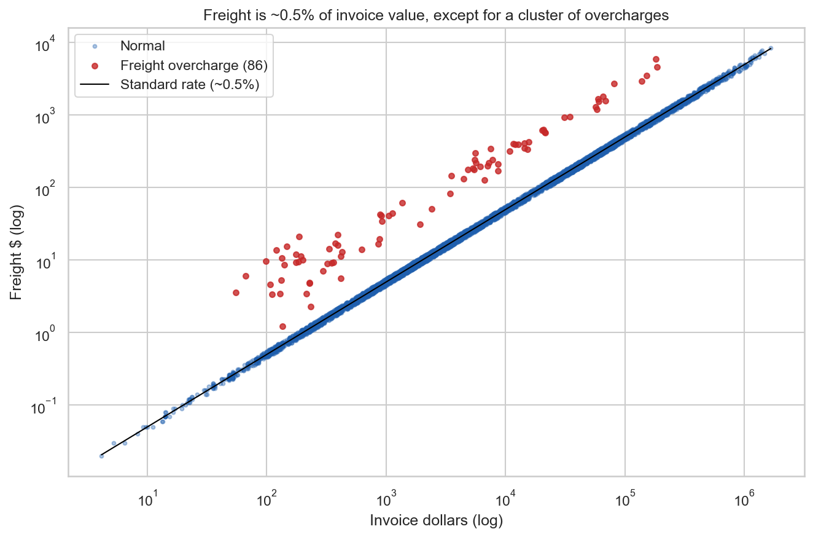
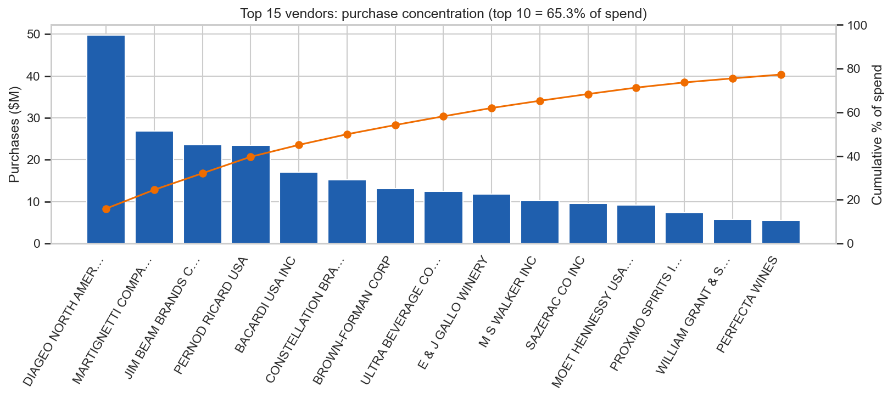
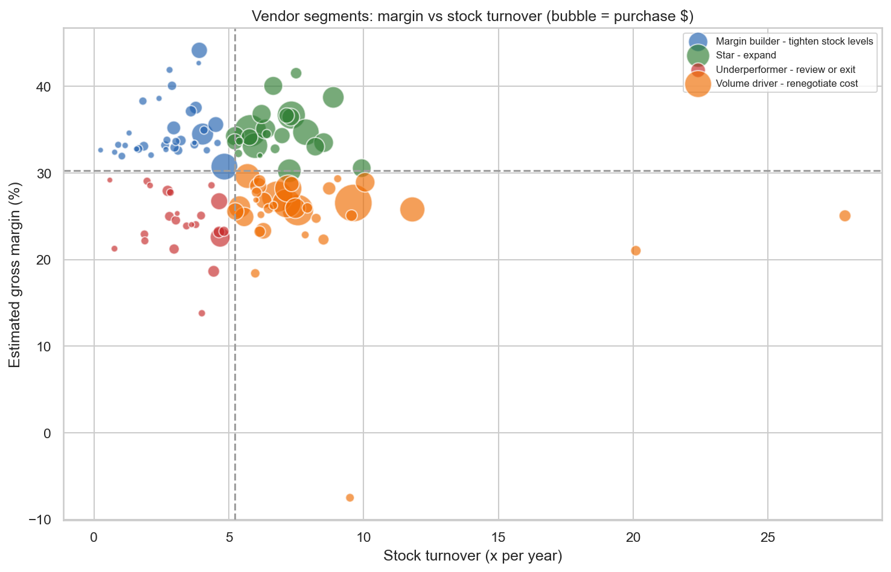
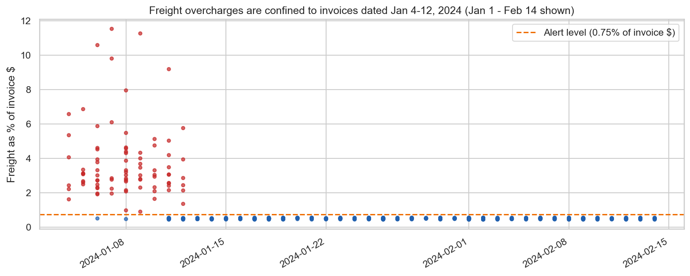
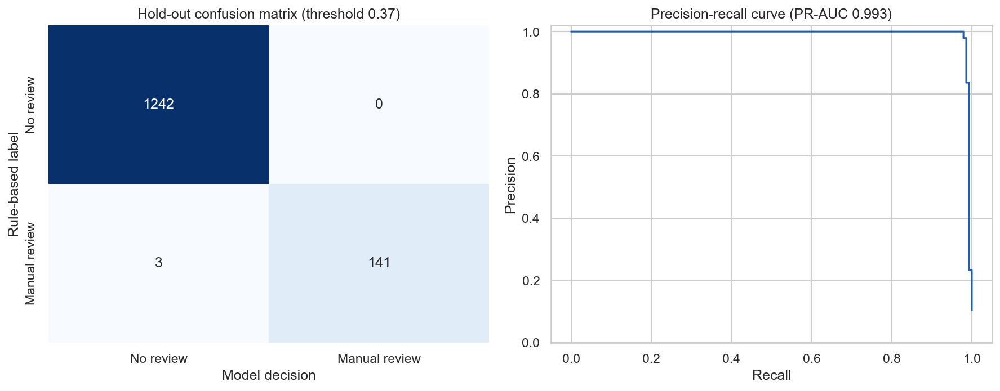

# Vendor Performance Analysis - Retail Inventory & Sales

**SQL + Python + Machine Learning + Streamlit**

> Analyzing vendor efficiency and profitability to support strategic purchasing and inventory decisions, plus two ML models: **freight cost prediction** and **invoice manual-approval prediction**.

## Table of Contents
- [Overview](#overview)
- [Business Problem](#business-problem)
- [Dataset](#dataset)
- [Tools & Technologies](#tools--technologies)
- [Project Structure](#project-structure)
- [Data Cleaning & Preparation](#data-cleaning--preparation)
- [Exploratory Data Analysis](#exploratory-data-analysis)
- [Research Questions & Key Findings](#research-questions--key-findings)
- [Machine-Learning Models](#machine-learning-models)
- [Dashboard](#dashboard)
- [How to Run This Project](#how-to-run-this-project)
- [Final Recommendations](#final-recommendations)
- [Limitations](#limitations)
- [Author & Contact](#author--contact)

## Overview
This project is an end-to-end analytics and machine-learning workflow for a retailer that buys from 126 vendors ($311.61M of purchases in 2024). It ingests raw CSV exports into **SQLite**, builds a vendor-level summary with **SQL** (CTEs, joins, window functions) and **Python**, scores and segments every vendor, trains two **scikit-learn** models, and delivers the results as executed notebooks, a **Streamlit** dashboard and a PDF report.

## Business Problem
Effective inventory and sales management needs answers to questions such as:
- Which vendors contribute most to purchases, and how concentrated is the spend?
- Which vendors are profitable and efficient, and which tie up capital in slow stock?
- Is freight reasonable, and can it be predicted?
- Which invoices show misbehaviour and should go to **manual approval**?

The goal is to identify vendor-management weaknesses, reduce inefficiency and improve control over purchasing.

## Dataset
Four raw exports in `data/`:

| File | Content | Rows |
|---|---|---|
| `export_output_vendor_invoice.csv` | One row per PO invoice: vendor, PO/invoice/pay dates, quantity, dollars, freight, approver | 5,543 |
| `export_output_purchase_prices.csv` | Product catalog: brand, vendor, retail and purchase price | 12,261 |
| `export_output_begin_inventory.csv` | On-hand units by store and brand, 2024-01-01 | 206,529 |
| `export_output_end_inventory.csv` | On-hand units by store and brand, 2024-12-31 | 224,489 |

**Generated by the pipeline** (the requested output is `export_output_purchases.csv`):

| File | Content |
|---|---|
| `export_output_purchases.csv` | **PO-level purchases fact table** (5,543 rows): cleaned, with unit cost, landed cost, freight %, lead time, payment terms, in-period flag |
| `export_output_vendor_summary.csv` | One row per vendor: purchase, inventory and efficiency KPIs, composite score, segment |
| `export_output_sku_margins.csv` | One row per SKU: catalog margin, begin/end inventory |
| `export_output_invoice_risk.csv` | Every invoice with rule flags, expected freight, model risk probability and decision |
| `data_quality_report.json`, `key_findings.json` | Reconciliation checks, assumptions and every headline number |

> **Data limitation.** The inputs contain **no sales file and no PO line items** (brand/store level). Units sold, revenue and gross profit are therefore **estimated** per vendor with the inventory balance equation `begin inventory + units purchased - end inventory`, using inventory-weighted shelf prices. Vendors with fewer than 3 POs or 100 units available are excluded from sales-based KPIs. See [Limitations](#limitations).

## Tools & Technologies
- **SQL (SQLite)** - ingestion, CTEs, joins, window functions
- **Python** - pandas, NumPy, SciPy, scikit-learn, joblib
- **Visualization** - Matplotlib, Seaborn, Plotly
- **Dashboard** - Streamlit
- **Reporting** - Jupyter notebooks, ReportLab (PDF)
- **Quality** - pytest, logging, reconciliation assertions

## Project Structure
```
vendor-performance-analysis/
├── README.md
├── Vendor Performance Report.pdf        # 11-page report
├── requirements.txt
├── .gitignore
├── data/                                # raw inputs + generated outputs (inventory.db is git-ignored)
├── notebooks/
│   ├── exploratory_data_analysis.ipynb  # data quality, distributions, outliers, correlations
│   └── vendor_performance_analysis.ipynb# research questions, hypothesis test, both ML models
├── scripts/
│   ├── config.py                        # paths, thresholds, seeds
│   ├── ingestion_db.py                  # raw CSV -> SQLite (chunked, logged, row-count checked)
│   ├── get_vendor_summary.py            # SQL + pandas: purchases, SKU, vendor summary, quality report
│   ├── risk_rules.py                    # definition of "misbehaviour" (anomaly flags)
│   ├── ml_utils.py                      # features, estimators, metrics, scoring helper
│   ├── train_freight_model.py           # model 1
│   ├── train_approval_model.py          # model 2
│   ├── analysis.py                      # research questions + key findings
│   ├── make_figures.py                  # charts in images/
│   ├── make_report.py                   # builds the PDF
│   └── run_all.py                       # runs the whole pipeline
├── models/                              # trained models + metrics JSON
├── dashboard/app.py                     # Streamlit dashboard (8 tabs)
├── images/                              # charts used here and in the report
└── tests/test_pipeline.py               # 9 sanity tests
```

## Data Cleaning & Preparation
- Loaded all files into SQLite with indexes; asserted that DB row counts equal CSV row counts.
- Built the purchases table in SQL: canonical vendor name (latest invoice, via `ROW_NUMBER()`), unit cost, freight %, lead time (`julianday`), payment terms, approver, in-period flag.
- Validated: positive quantity and dollars, non-negative freight, correctly ordered dates, unique PO numbers.
- Handled: 2 vendors renamed mid-year, 1 invoiced vendor missing from the catalog, 6 catalog vendors never invoiced, 2 SKUs with zero pricing, 140 POs invoiced after year-end (kept, flagged `InPeriod = False`), 1 store with a missing city.
- **Reconciliation:** purchase dollars, units and begin/end inventory units of the vendor summary tie back to the source tables on every run.

## Exploratory Data Analysis
Full detail in `notebooks/exploratory_data_analysis.ipynb`.
- Invoice value is extremely right-skewed (median $4,765, mean $58,073, maximum $1,660,436); lead time (9-23 days) and payment terms (23-48 days) are tightly bounded.
- **Freight is almost exactly 0.5% of invoice dollars** (correlation 0.985), except for a cluster of 86 overcharged invoices.
- **Manual approval is a pure dollar rule:** all 374 invoices of about $250.7K or more were approved (one approver), none below $250K.



## Research Questions & Key Findings
**1. How concentrated are purchases?** The top 10 vendors account for **65.3%** of purchases (HHI 604); the bottom 63 vendors supply only **0.7%**, a consolidation candidate.



**2. Which vendors are efficient and profitable?** A composite score (margin 35%, sell-through 20%, turnover 20%, lead time, lead-time consistency, freight %, payment terms) and a margin x turnover quadrant give four segments:

| Segment | Vendors | Share of spend | Action |
|---|---|---|---|
| Star | 24 | 34.3% | Expand |
| Margin builder | 34 | 7.6% | Tighten stock levels |
| Volume driver | 34 | 55.8% | Renegotiate cost |
| Underperformer | 23 | 2.4% | Review or exit |
| Insufficient data | 17 | 0.01% | Not scored |

The largest spirits suppliers (Diageo, Jim Beam, Pernod Ricard, Bacardi) are fast-turning but earn below-median margin. Highest scores: E & J Gallo Winery, Majestic Fine Wines, Treasury Wine Estates, Constellation Brands Inc, Wine Group Inc.



**3. Which brands need promotion or repricing?** 377 SKUs combine a top-quartile margin (average 41%), growing inventory and a large stock value ($5.64M at cost). Brand-level sales are unavailable, so growing stock is the proxy for slow movement.

**4. How much capital is tied up in inventory?** Inventory at cost grew **18.2%** ($46.91M to $55.43M). The 23 underperformer vendors hold $1.86M on 2.4% of spend.

**5. Does bulk purchasing lower unit cost?** **No evidence.** Within a vendor, the median unit-cost index of the largest orders is 0.995 vs 0.997 for the smallest; freight is about 0.51% at every order size.

**6. Do high-spend vendors earn different margins?** **No.** Welch t-test on top- vs bottom-quartile spend vendors: 30.9% vs 30.1%, difference 0.87 pp, p = 0.55, 95% CI [-2.0, 3.8] pp. Vendor size does not predict profitability.

## Machine-Learning Models
### Model 1 - Freight cost prediction
Predicts the freight an invoice *should* carry from information known on arrival. **Temporal hold-out:** trained on invoices before 2024-10-01, tested on the 1,564 invoices from then on. Candidates: 0.5% rule baseline, linear regression, ridge, random forest, gradient boosting.

| Model | CV MAE | Test MAE | Test R2 | Median % error |
|---|---|---|---|---|
| Baseline (median rate x dollars) | $15.79 | $17.14 | 0.9955 | 5.6% |
| Linear regression (dollars) | $15.84 | $17.15 | 0.9955 | 5.6% |
| Ridge (dollars, quantity) | $15.89 | $17.52 | 0.9955 | 5.1% |
| Random forest (rate) | $15.79 | $17.84 | 0.9950 | 5.3% |
| Gradient boosting (rate) | $16.41 | $16.88 | 0.9962 | 5.3% |

**Result:** no ML model beats the rule *freight = 0.50% of invoice dollars* (test MAE $17.15 vs $17.14 for the baseline). Freight is proportional to order value and the other features add nothing, so the simplest model is selected: `Freight = 0.00500 x Dollars (no intercept)`. This is an honest negative result: complexity would add opacity for no accuracy.

**Use:** as a benchmark. It exposed **86 overcharged invoices** (median 6.1x expected freight, about **$32,878 excess**), all dated 2024-01-04 to 2024-01-12: a systematic billing event, not noise.



### Model 2 - Invoice manual-approval prediction
**Target** `ManualApprovalRequired` = the $250K approval policy recovered from the data **OR** any anomaly flag:

| Flag | Rule |
|---|---|
| High value | invoice >= $250K |
| Freight overcharge | freight above 1.5x the standard 0.5% rate |
| Unit-cost outlier | unit cost >= 2x or <= 0.5x the vendor median |
| Lead-time / payment-terms outlier | abs(robust z) > 4 versus the vendor's norm |
| Repeat invoice | same vendor, dollars and quantity within 14 days |

580 of 5,543 invoices (10.5%) need review. The classifier sees only invoice values and how they compare with the vendor's norms (training data only) plus the freight model's expected freight - never the flags or the approval column. **Random forest** was selected by 5-fold CV PR-AUC; the threshold maximises F2.

| Evaluation | Precision | Recall |
|---|---|---|
| Hold-out (25% of invoices) | 0.966 | 0.986 |
| Invoices below $250K only | 0.906 | 0.960 |
| Time-based split (train before Oct) | 0.972 | 0.983 |
| $250K rule alone (current control) | 1.000 | 0.653 |
| Isolation Forest (unsupervised), precision@k | 0.465 | 0.465 |



**Control gap:** 206 invoices below $250K carried an anomaly flag but were never manually approved (**$2.58M**).

> **Honest framing.** The labels are rule-derived (weak supervision), not confirmed fraud. The scores show the review policy is learnable and can be applied to new invoices with a probability attached; they do not prove independent fraud detection. The rarest flags (lead time, payment terms, repeat invoices) have only a handful of examples and are not reliably learned by the model, so the rules should remain in place.

## Dashboard
`streamlit run dashboard/app.py` opens an 8-tab dashboard: executive overview, vendor scorecard with drill-down, profitability and inventory (incl. promotion candidates), procurement operations, **freight cost model** (with an order freight estimator), **invoice risk model** (review queue and a *check a new invoice* tool), insights and statistics, and methodology. Filters: vendor segment, minimum spend, month range. *(Screenshots are not included; run the app to see it.)*

## How to Run This Project
```bash
# 1. install
pip install -r requirements.txt

# 2. run everything (ingest -> tables -> both models -> findings -> figures), ~1 minute
python scripts/run_all.py

# 3. optional: rebuild the PDF, run the tests
python scripts/make_report.py
pytest -q

# 4. dashboard
streamlit run dashboard/app.py
```
Or step by step: `python scripts/ingestion_db.py`, `python scripts/get_vendor_summary.py`, `python scripts/train_freight_model.py`, `python scripts/train_approval_model.py`. Notebooks (in `notebooks/`) read the SQLite database, so run step 2 first. Outputs are deterministic (fixed seeds).

## Final Recommendations
1. **Close the approval control gap:** add freight and unit-cost anomaly triggers to the $250K rule; use the risk model to rank the review queue.
2. **Recover the January freight overcharges** (about $32,878 across 86 invoices) and monitor freight against the 0.5% expected rate.
3. **Renegotiate with the Volume drivers** (56% of spend at below-median margin).
4. **Release cash from slow stock:** start with the 377 high-margin SKUs with growing inventory; review the 23 underperformers.
5. **Consolidate the vendor tail** while managing dependence on the top 10.
6. **Do not budget on volume discounts or consolidation freight savings:** neither appears in the data.

## Limitations
- No sales or PO line-item data: units sold, revenue and profit are inventory-balance estimates; invoice date stands in for receiving date; lead time is PO-to-invoice, so on-time delivery cannot be measured.
- Approval labels are rule-derived; the model operationalises the policy and is not independent fraud detection.
- Freight overcharges occur in one nine-day window, so they cannot be validated across time.
- Promotion candidates use growing stock as a proxy for slow sales.

## Author & Contact
**Sayan Jana** - github.com/syan-spec.
